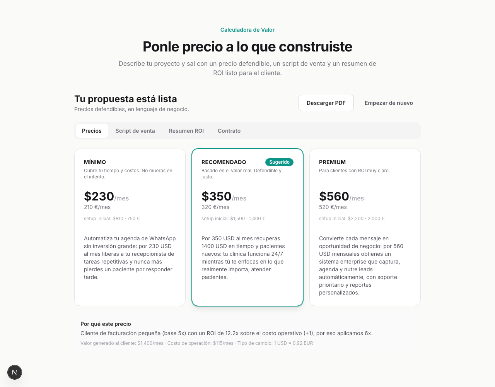
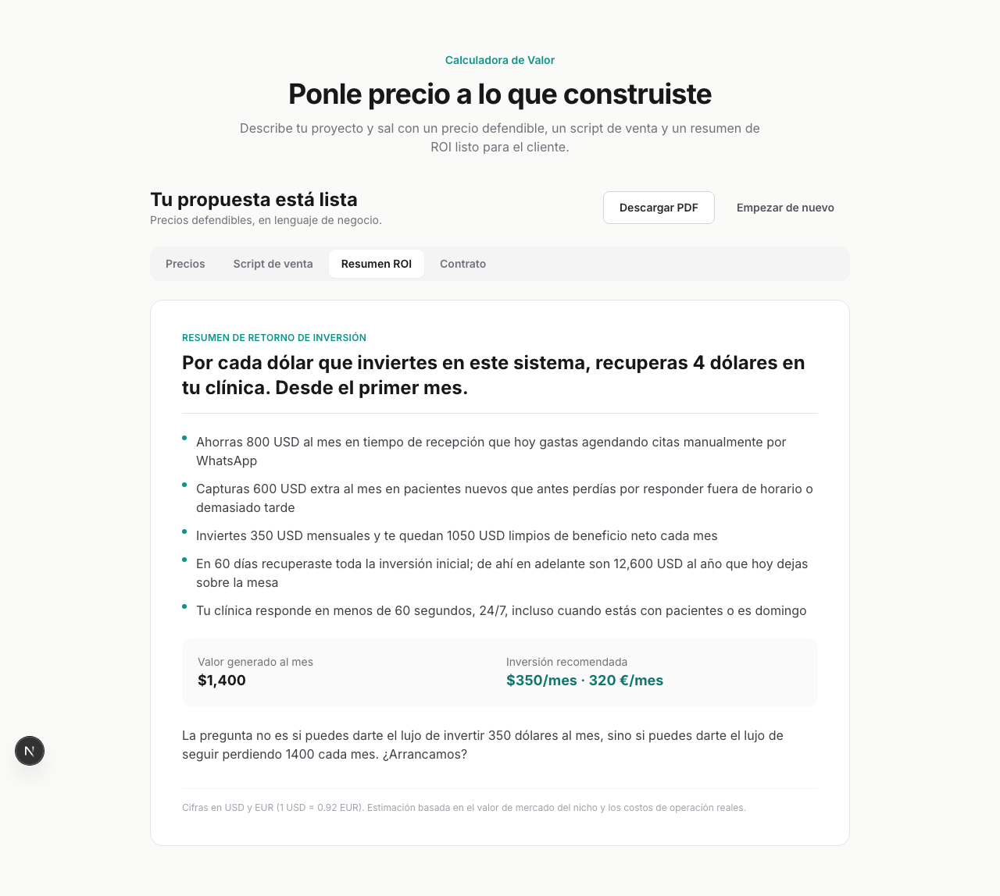

# Calculadora de Valor

> Ponle precio defendible a lo que construyes con IA. En menos de 5 minutos, sin hablar de tecnología.

Una herramienta conversacional para freelancers, agencias y consultores que construyen
agentes, automatizaciones y SaaS con IA y **no saben cuánto cobrar**. Describe el proyecto
que construiste y sal con un precio en tres tramos, un script de venta, un resumen de ROI
para el cliente y la estructura del contrato — en USD y EUR, adaptado al mercado LATAM/España.





---

## El problema

Los constructores de IA enfrentan tres fricciones al cerrar un cliente:

1. **No saben cuánto cobrar** por lo que construyen.
2. **No saben justificar el precio** sin sonar a "vende humos".
3. **No calculan su margen real** (APIs, VPS, tokens, mantenimiento).

Esta herramienta resuelve el problema **comercial**: cómo monetizar lo que construyes.

## Cómo funciona

El flujo tiene tres fases:

1. **Intake (formulario guiado).** Respondes 6 preguntas: qué construiste, para qué nicho,
   cuántas horas te tomó, qué stack usaste, el tamaño del cliente y la modalidad de venta.
2. **Estimación de valor.** La IA estima los valores de mercado (tarifa del nicho, horas
   ahorradas, ingresos habilitados, costos de operación). **Los puedes editar todos**: el
   precio se recalcula al instante.
3. **Propuesta.** Obtienes tres precios (mínimo / recomendado / premium), un script de venta,
   un resumen de ROI de una página (exportable a PDF) y la estructura del contrato.

### El precio es determinista, no inventado

La decisión de diseño central: **un motor de pricing en TypeScript puro calcula todos los
precios**. La IA nunca calcula ni redondea una cifra — solo estima valores de mercado (que tú
confirmas) y redacta la prosa de venta alrededor de números ya congelados.

Esto importa porque hace los precios **reproducibles y defendibles**: la misma entrada
siempre da el mismo precio, y cada cifra se traza a una fórmula que puedes inspeccionar.

La lógica (en [`src/features/calculator/services/pricing/`](src/features/calculator/services/pricing)):

- **Valor mensual al cliente** = horas ahorradas × tarifa del nicho + ingresos habilitados.
- **Costo de operación** = APIs + infraestructura + (horas de mantenimiento × tu tarifa).
- **Multiplicador 5x–10x** según el tamaño del cliente y el ROI.
- **Precio recomendado** = `min(costo × multiplicador, 25% del valor generado)` — topado al
  25% del valor para que el cliente conserve siempre ≥75%. Eso es lo que lo hace defendible.

## Stack

| Capa | Tecnología |
|------|------------|
| Framework | Next.js 16 + React 19 + TypeScript |
| Estilos | Tailwind CSS 3.4 |
| IA | Vercel AI SDK v6 + OpenRouter (Claude Sonnet) |
| Validación | Zod |
| Estado | Zustand |
| Tests | Vitest (motor de pricing) + Playwright (e2e) |

## Puesta en marcha

**La forma fácil:** sigue **[`instalar.md`](instalar.md)** — instala solo con tu agente de
IA, con un comando (`bash instalar.sh`), o manual. Requisitos: Node 18+ y una API key de
[OpenRouter](https://openrouter.ai/keys).

Manual, en 3 pasos:

```bash
# 1. Instalar dependencias
npm install

# 2. Configurar variables de entorno
cp .env.example .env.local
# Edita .env.local y pega tu propia OPENROUTER_API_KEY

# 3. Arrancar
npm run dev
```

Abre **http://localhost:3000** y entra a la calculadora.

> **Sin API key igual funciona:** el precio determinista se calcula y los estimados caen a
> tablas de referencia LATAM/España. Solo la redacción de la IA (script, ROI, contrato) queda
> deshabilitada, con un botón para reintentar cuando agregues la key.

### Variables de entorno

| Variable | Requerida | Para qué |
|----------|-----------|----------|
| `OPENROUTER_API_KEY` | Recomendada | Estimaciones y redacción con IA. Cada quien usa la suya. |
| `NEXT_PUBLIC_USD_TO_EUR` | No (default 0.92) | Tipo de cambio USD→EUR mostrado. |

> Tu `.env.local` está en `.gitignore` y **nunca** se sube al repo. Si compartes el proyecto
> por git, tu clave no viaja. (Si lo compartes como `.zip` de la carpeta, sí incluiría
> `.env.local` — usa `git archive` o GitHub para compartir de forma segura.)

## Scripts

```bash
npm run dev         # Servidor de desarrollo
npm run build       # Build de producción
npm run typecheck   # Verificación de tipos (tsc --noEmit)
npm run test        # Tests del motor de pricing (Vitest)
npm run test:e2e    # Smoke e2e del flujo (requiere dev server + npx playwright install chromium)
```

## Notas de la versión actual (MVP)

- **Sin login.** Todo corre en memoria; no se persiste nada. (Listo para agregar auth después.)
- **Export a PDF** vía la impresión del navegador ("Guardar como PDF"), con CSS que aísla el
  resumen de ROI de una página.
- **Mercado LATAM/España:** tarifas conservadoras por defecto, cifras en USD y EUR.

## Arquitectura

Feature-First: todo lo de la calculadora vive en
[`src/features/calculator/`](src/features/calculator) (schemas, motor de pricing, servicios de
IA, store y componentes). Las rutas de IA están en `src/app/api/calculator/`.

---

Construido con **Raíz** para la comunidad **Imperio Agéntico**.
